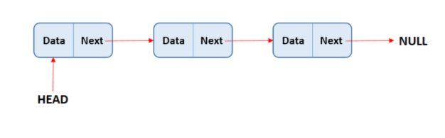

# Linked Lists
## Singly Linked Lists
- First Node : Head
- Last Node : Tail (*pointing null)
- There is a Node that has a value and pointer.
- A node is linked to next node until the last element that points to null.

### Time complexity
```
prepend O(1)
append O(1)
lookup O(n)
insert O(n)
delete O(n)
```
### Memory Efficiency
- This is useful when there is uncertainty about size or there are large variations in the size of data elements; memory equivalent to the upper limit on the size has to be allocated (even if not all of it is being used) while using arrays, whereas linked lists can increase their sizes step-by-step proportionately to the amount of data.


### pseudocode
```
Linked list : apples --> grapes --> pears


apples (head)
pointer --------> grapes   
         pointer -------->  Pears (tail)
                            pointer --------> null
```
## Doubly Linked LIsts
