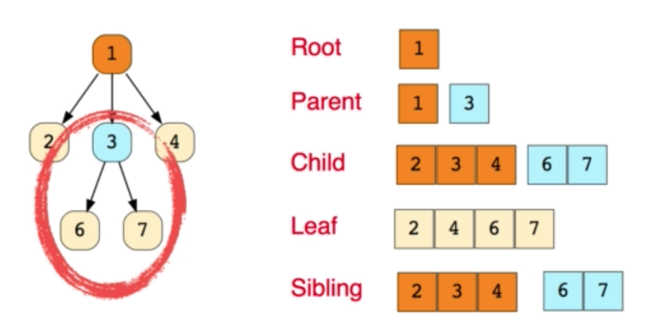
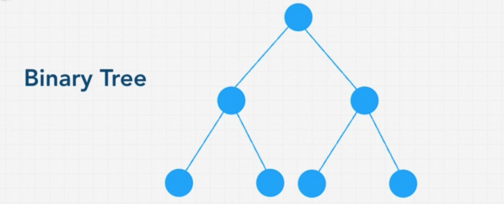
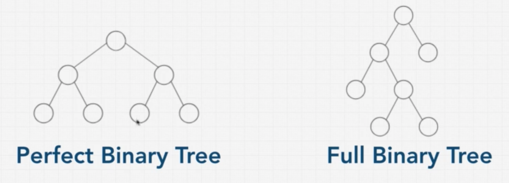
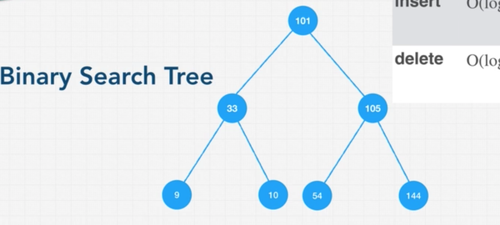

# Trees

- 

- Trees are a data structure that we call a hierarchical structure.
- Linear trees can have a zero or more child nodes.
- A tree usually start with a single root node or a parent node.
- every child of the tree descends from this root node.
- We use the same principle as we did in linked lists. ( node, pointer )

## Binary Tree
- 
- Each node can only have either zero, one or two nodes.
- Each child can only have one parent.
- Right of the node must be greater than the current node.
- Left of the node must be less than the current node.
```js
class BinaryTreeNode {
    constructor(value) {
        this.left = null;
        this.right = null;
        this.value = value;
    }
}
```
### Perfect Binary Tree
- 
- All the leaf nodes are full and there's no node that has only one child.
- That is, There is zero children or two children.
- Bottom layer of the tree is completely filled.
- It has two really interesting properties. 
  1. the number of total nodes on each level is doubled the previous level.
  2. the number of nodes on Bottom level equal the number of nodes above the level  + 1
    By organizing our data in this way, we have half of this data in the bottom level. It means, we can avoid visiting every node even if the node we're looking for is at the very bottom. so It can get lower time complexity, O(logn)

### Full Binary Tree
- a node has either a zero or two children, but never one child

## Binary Search Tree - BST
- 
- lookup O(log N)
- insert O(log N)
- delete O(log N)
- Binary Search Tree is a node-based binary tree data structure which has the following properties:
- Each Node can only have either zero, one, or two nodes
- The left subtree of a node contains only nodes with keys lesser than the node’s key.
- The right subtree of a node contains only nodes with keys greater than the node’s key.
- The left and right subtree each must also be a binary search tree.

```js
The # of Nodes on the Level
    Level 0: 2^0 = 1;
    Level 1: 2^1 = 2;
    Level 2: 2^2 = 4;
    Level 3: 2^3 = 8;

Total # of Nodes = 2^height - 1;
=> log nodes = height, (Ignoring -1)

* 10^2 = 100 => log 100 = 2;

```